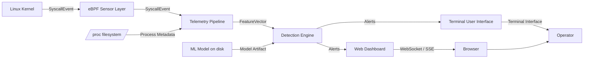
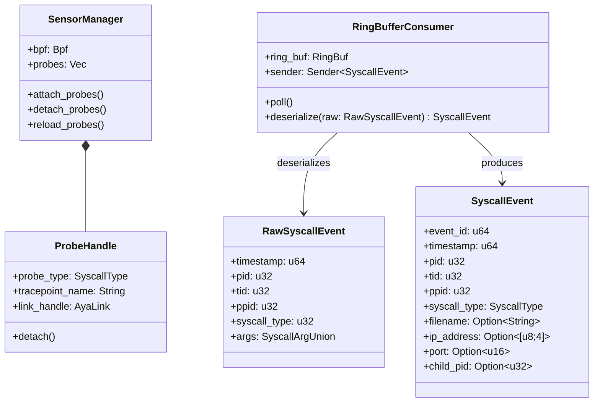
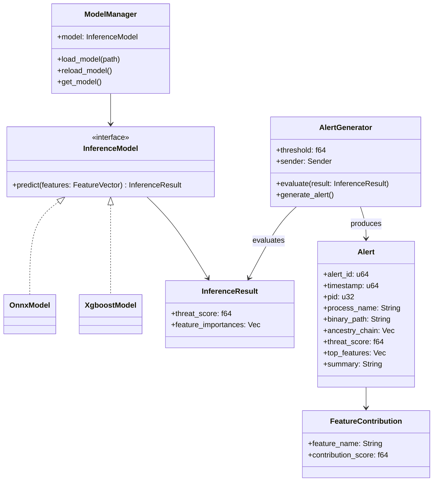
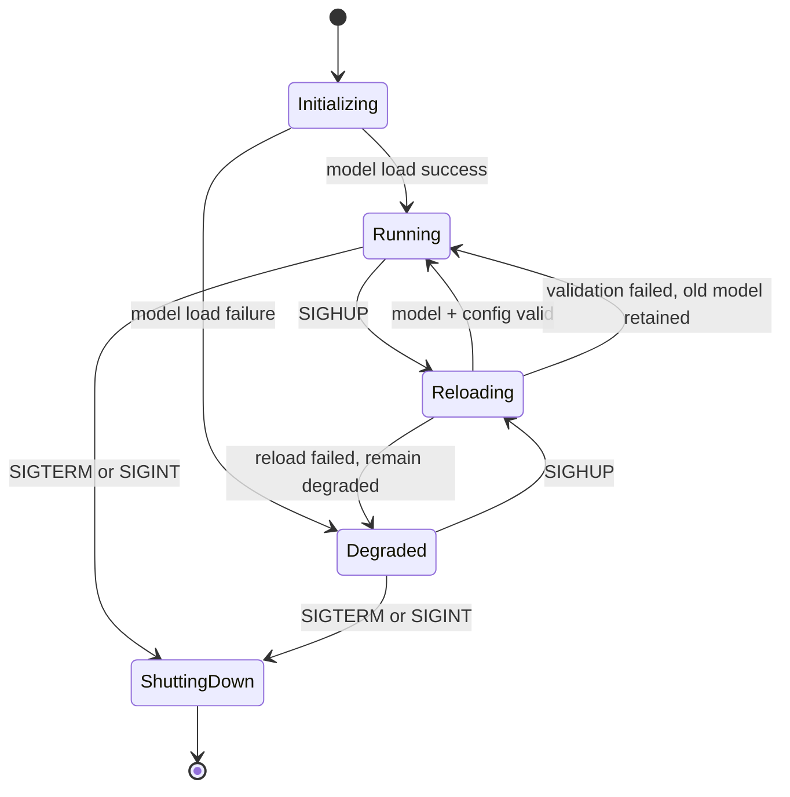

# Mini-EDR Software Design Document

## 1. Introduction

### 1.1 Purpose

This Software Design Document (SDD) describes the architecture, component design, data structures, and interface specifications for Mini-EDR, a lightweight Endpoint Detection and Response system built on eBPF kernel instrumentation and on-device machine learning inference. The intended audience includes the development team (sensor engineers, pipeline engineers, ML engineers, frontend engineers, and the DevOps/integration lead), the course instructor and graders for SWE 3313, and any future contributors or maintainers of the system.

### 1.2 Scope

Mini-EDR is a Linux daemon and accompanying visualization interfaces that provide real-time endpoint threat detection on a single host. The system monitors kernel-level process activity through eBPF tracepoint probes, enriches raw events with process metadata, computes behavioral feature vectors over sliding time windows, and classifies process behavior using a locally-deployed XGBoost model. Alerts exceeding a configurable threat-score threshold are surfaced through a terminal user interface (TUI) and a localhost web dashboard.

The goals of this design are to achieve low-overhead kernel instrumentation (under 2% CPU overhead), sub-5-second end-to-end detection latency, modular subsystem boundaries enabling independent development and testing, and a portable implementation across Linux kernels 5.8 and above. The system does not perform automated remediation, does not support multi-host fleet management, and is restricted to Linux `x86_64`.

### 1.3 Overview

This document is organized into eight sections. Section 2 provides a system overview. Section 3 describes the high-level system architecture, technical design, and design rationale. Section 4 presents detailed component designs including class diagrams and behavioral diagrams. Section 5 covers data design and storage. Section 6 describes the human interface design for both the TUI and web dashboard. Section 7 provides a requirements traceability matrix mapping functional requirements from the SRS to design components. Section 8 contains appendices with supplementary material.

### 1.4 Reference Material

1. Mini-EDR Software Requirements Specification (SRS), SWE 3313, Team 4, 2026.
3. Highnam, K. et al. “BETH Dataset: Real Cybersecurity Data for Anomaly Detection Research.” ICML Workshop, 2021.
4. Chen, T. and Guestrin, C. “XGBoost: A Scalable Tree Boosting System.” KDD 2016.
5. Aya eBPF Library Documentation. https://aya-rs.dev/
6. Linux Kernel BPF Documentation. https://docs.kernel.org/bpf/
7. ONNX Runtime Documentation. https://onnxruntime.ai/
8. ratatui Terminal UI Library. https://ratatui.rs/
9. Cilium Tetragon: eBPF-based Security Observability. https://tetragon.io/

### 1.5 Definitions and Acronyms

| Term | Definition |
| --- | --- |
| EDR | Endpoint Detection and Response. Security software that monitors host machines for threats. |
| eBPF | Extended Berkeley Packet Filter. Linux kernel technology for running sandboxed programs in kernel space. |
| CO-RE | Compile Once, Run Everywhere. BPF portability mechanism using BTF metadata. |
| BTF | BPF Type Format. Metadata enabling eBPF program portability across kernel versions. |
| Aya | A pure-Rust library for writing, loading, and managing eBPF programs. |
| ONNX | Open Neural Network Exchange. Open format for representing ML models. |
| XGBoost | Extreme Gradient Boosting. Gradient-boosted decision tree algorithm for classification. |
| TUI | Terminal User Interface. Text-based graphical interface in a terminal emulator. |
| TOML | Tom’s Obvious Minimal Language. Configuration file format used by the daemon. |
| SSE | Server-Sent Events. Server push technology for real-time client updates over HTTP. |
| SDD | Software Design Document. This document. |
| SRS | Software Requirements Specification. The companion requirements document for Mini-EDR. |

## 2. System Overview

Mini-EDR is a single-host, Linux-native endpoint detection system designed to provide lightweight, cloud-independent security visibility using modern kernel instrumentation. It operates as a privileged daemon (requiring `CAP_BPF` and `CAP_PERFMON` or root) that attaches eBPF tracepoint probes to four critical syscalls (`execve`, `openat`, `connect`, and `clone`) and streams captured events through a processing pipeline that culminates in on-device ML-based threat classification.

The system runs entirely on the monitored host with no external dependencies at runtime. Raw kernel events flow from BPF ring buffers into a userspace telemetry pipeline written in Rust, where they are enriched with process metadata from the `/proc` filesystem and aggregated into per-process sliding windows. Each window is transformed into a feature vector encoding behavioral patterns (syscall frequencies, path entropy, network activity, timing distributions) which is then scored by a pre-trained XGBoost classifier. Processes exceeding a configurable threat-score threshold trigger structured JSON alerts.

Two visualization interfaces consume the alert and telemetry streams. A terminal user interface (TUI) built with ratatui provides a live process tree with color-coded threat scores and a scrollable alert timeline for operators who prefer command-line workflows. A localhost-bound web dashboard served over HTTP with WebSocket/SSE provides the same information in a browser with additional filtering, drill-down, and health monitoring capabilities.

The system is designed for educational and resource-constrained environments. It does not perform automated remediation (process killing, host isolation), does not aggregate data across multiple hosts, and binds its web interface exclusively to localhost by default. Its architecture is modular: sensor, pipeline, detection engine, TUI, and web server are independent Rust crates, enabling parallel development and independent unit testing.

## 3. System Architecture

### 3.1 Architectural Design

Mini-EDR follows a layered pipeline architecture with strict unidirectional data flow. The system is decomposed into five primary subsystems, each implemented as an independent Rust crate with well-defined interfaces:

- **eBPF Sensor Layer:** Responsible for attaching tracepoint probes to kernel syscalls (`execve`, `openat`, `connect`, `clone`) and delivering raw event structs to userspace via the BPF ring buffer. This layer runs partially in kernel space (the eBPF programs) and partially in userspace (the probe loader and ring buffer consumer). It is the sole point of contact with the Linux kernel instrumentation subsystem.
- **Telemetry Pipeline:** Consumes raw events from the ring buffer, deserializes them into Rust structs, and enriches each event with process metadata read from `/proc` (process name, binary path, cgroup, UID, ancestry chain). Enriched events are aggregated into per-process sliding windows of configurable duration (default 30 seconds), and each completed window is transformed into a fixed-size feature vector.
- **Detection Engine:** Loads a pre-trained ML model (XGBoost in ONNX or native format) at daemon startup and runs inference on each feature vector to produce a threat score between `0.0` and `1.0`. Scores exceeding the configurable alert threshold (default `0.7`) trigger alert generation with full process context and feature attribution. Supports hot-reload of the model artifact via `SIGHUP`.
- **Terminal User Interface (TUI):** A ratatui-based text interface displaying a live process tree with color-coded threat levels, a scrollable alert timeline, real-time event counters, and process detail drill-down. Communicates with the daemon core via in-process channels.
- **Web Dashboard:** An HTTP server binding to localhost that serves a browser-based interface with equivalent functionality to the TUI. Real-time updates are pushed via WebSocket or Server-Sent Events. Provides additional filtering, time-range selection, and system health metrics.

Data flows strictly in one direction through the pipeline: `SyscallEvent -> EnrichedEvent -> FeatureVector -> Alert`. No downstream component writes back to an upstream stage. The eBPF Sensor Layer produces `SyscallEvent`s; the Telemetry Pipeline transforms them into `EnrichedEvent`s and then `FeatureVector`s; the Detection Engine consumes `FeatureVector`s and produces `Alert`s; and both visualization interfaces consume `Alert`s and telemetry summaries for display.

Inter-subsystem communication within the daemon uses Rust async channels (`tokio::sync::mpsc` and `broadcast`). The sensor publishes raw events onto a channel consumed by the pipeline. The pipeline publishes feature vectors onto a channel consumed by the detection engine. The detection engine broadcasts alerts and telemetry to both the TUI and web server subscribers. This channel-based architecture provides natural backpressure, allows subsystems to operate at independent rates, and facilitates testing through mock channel injection.

#### High-Level Architecture Diagram (reconstructed from the original PDF)

### 3.2 Technical Design

The following technologies and frameworks compose the technical stack:

- **Language and Runtime:** The entire daemon is written in Rust using the stable toolchain. Rust provides memory safety without garbage collection, zero-cost abstractions, and direct access to Linux syscall interfaces; critical properties for a security-sensitive system that must run with kernel-level privileges.
- **Async Runtime:** Tokio is used as the async runtime for the userspace daemon. All I/O-bound operations (ring buffer polling, `/proc` reads, HTTP serving, WebSocket connections) run on the Tokio executor, enabling efficient concurrency without thread-per-connection overhead.
- **eBPF Toolchain:** Aya (`aya-rs`) is used for writing, compiling, and loading eBPF programs entirely in Rust, eliminating the need for a C toolchain or `libbpf` dependency. Aya provides CO-RE support via BTF, enabling compiled probes to run across kernel versions 5.8 through 6.x without recompilation.
- **ML Inference:** The pre-trained XGBoost model is exported to ONNX format and loaded at runtime via the `ort` crate (Rust bindings to ONNX Runtime). Alternatively, XGBoost native JSON format can be loaded via `xgboost-rs`. Inference runs synchronously on CPU; the sub-10ms latency target does not require GPU acceleration for the model sizes involved.
- **TUI Framework:** ratatui provides the terminal rendering layer, with crossterm as the backend for cross-terminal compatibility. The TUI runs on a dedicated Tokio task and receives updates via broadcast channel subscription.
- **Web Server:** axum (built on hyper and Tokio) serves the web dashboard as static HTML/CSS/JS assets and exposes a WebSocket endpoint for real-time event streaming. The server binds to `127.0.0.1` by default.
- **Configuration:** The `toml` crate parses the TOML configuration file at startup. Configuration values are validated and loaded into a typed Rust struct distributed to subsystems via `Arc<Config>`.
- **Serialization:** `serde` and `serde_json` handle serialization of alert records to the append-only JSON log file and to the WebSocket/SSE output stream.

### 3.3 Design Rationale

The layered pipeline architecture was chosen over alternative designs for the following reasons:

- **Pipeline vs. Monolithic:** A monolithic architecture would tightly couple sensor, processing, and display logic, making it difficult to test subsystems in isolation or to evolve them independently. The pipeline decomposition allows the sensor to be unit-tested against mock ring buffers, the pipeline to be tested with synthetic event streams, and the detection engine to be validated with pre-computed feature vectors—all without requiring a running kernel or eBPF privileges.
- **Pipeline vs. Event-Driven (Publish-Subscribe):** A full pub-sub architecture with a central event bus was considered but rejected as over-engineered for a single-host system with a fixed, linear data flow. The unidirectional pipeline with typed async channels provides the decoupling benefits of pub-sub without the complexity of a message broker or dynamic subscription management.
- **Rust vs. C/Go:** C is the traditional language for eBPF tooling (via `libbpf`), but requires manual memory management in a security-critical context. Go (used by Cilium Tetragon) provides garbage collection but introduces stop-the-world GC pauses that could affect latency guarantees under high event rates. Rust provides memory safety guarantees at compile time with predictable, GC-free performance, making it ideal for a system that must process 50,000+ events per second with sub-10ms inference latency.
- **Aya vs. libbpf-rs:** Aya was chosen over `libbpf-rs` because it allows eBPF programs to be written entirely in Rust (no C BPF code), provides a more ergonomic API for probe management, and maintains active community support. The tradeoff is a smaller ecosystem compared to `libbpf`, but the probe types required (tracepoints on well-known syscalls) are fully supported.
- **XGBoost/ONNX vs. Deep Learning:** Gradient-boosted trees were chosen over neural network architectures because they provide interpretable feature importances (critical for alert attribution), achieve strong classification performance on tabular/structured feature vectors, and produce inference latencies well under the 10ms target without GPU acceleration. The ONNX export path ensures the model is portable and can be loaded efficiently in the Rust runtime via the `ort` crate.
- **In-Memory + Append-Only Log vs. Database:** A traditional database (SQLite, PostgreSQL) was considered for alert and event storage but rejected because Mini-EDR is a real-time streaming system, not a query-heavy analytical tool. In-memory data structures provide the lowest-latency access for the TUI and dashboard, while the append-only JSON log provides durable, human-readable persistence without the operational complexity of a database server. This design satisfies the single-host, single-session scope of the system.

## 4. Detailed Design

### 4.1 Class Diagrams

The following describes the primary struct and trait relationships within each subsystem. Mini-EDR is implemented in Rust, so the class model is expressed in terms of structs, enums, traits, and their relationships rather than traditional OOP classes.

#### 4.1.1 Sensor Layer

The sensor layer consists of the following core types:

- **SensorManager:** The top-level struct responsible for loading eBPF programs into the kernel via Aya, attaching tracepoint probes, and managing their lifecycle. Holds references to the Aya `Bpf` object and a collection of `ProbeHandle` instances. Provides methods: `attach_probes()`, `detach_probes()`, and `reload_probes()`.
- **ProbeHandle:** Represents a single attached tracepoint probe. Stores the probe type (an enum: `Execve`, `Openat`, `Connect`, `Clone`), the tracepoint name, and the Aya link handle. Provides `detach()` for cleanup.
- **RawSyscallEvent:** A C-repr struct shared between the eBPF kernel program and userspace via the ring buffer. Fields: `timestamp (u64)`, `pid (u32)`, `tid (u32)`, `ppid (u32)`, `syscall_type (u32)`, and a union of syscall-specific argument payloads.
- **RingBufferConsumer:** Wraps the Aya `RingBuf`, polls for new events, deserializes `RawSyscallEvent` structs, converts them into `SyscallEvent` domain types, and sends them on a `tokio::sync::mpsc::Sender<SyscallEvent>` channel.
- **SyscallEvent:** The userspace domain representation of a raw kernel event. Fields: `event_id (u64)`, `timestamp (u64)`, `pid (u32)`, `tid (u32)`, `ppid (u32)`, `syscall_type (SyscallType enum)`, and typed argument fields (`filename: Option<String>`, `ip_address: Option<[u8;4]>`, `port: Option<u16>`, `child_pid: Option<u32>`).

#### Sensor Layer Relationships (reconstructed)

#### 4.1.2 Telemetry Pipeline

The telemetry pipeline consists of:

- **EventEnricher:** Receives `SyscallEvent` instances from the sensor channel and augments them with `/proc` metadata. Maintains a `ProcReader` dependency for filesystem access. Produces `EnrichedEvent` instances.
- **ProcReader:** Encapsulates all `/proc` filesystem reads. Methods: `read_status(pid)`, `read_exe(pid)`, `read_cgroup(pid)`, `read_stat(pid)`. Returns `Result` types to handle race conditions where processes exit between event capture and enrichment.
- **EnrichedEvent:** Extends `SyscallEvent` with `process_name (String)`, `binary_path (String)`, `cgroup (String)`, `uid (u32)`, and `ancestry_chain (Vec<ProcessInfo>)`.
- **ProcessInfo:** Lightweight descriptor for ancestry chains. Fields: `pid (u32)`, `process_name (String)`, `binary_path (String)`.
- **WindowAggregator:** Maintains a `HashMap<u32, ProcessWindow>` keyed by PID. Receives `EnrichedEvent`s, assigns them to the appropriate window, and emits completed `FeatureVector`s when a window closes (either by timeout or process exit).
- **ProcessWindow:** Tracks all events for a single process within the current sliding window. Fields: `pid (u32)`, `window_start (u64)`, `events (Vec<EnrichedEvent>)`. Provides `compute_features()` which returns a `FeatureVector`.
- **FeatureVector:** Fixed-size struct with `pid (u32)`, `window_start (u64)`, `window_end (u64)`, and approximately `20–40` `f64` feature fields (`syscall_counts`, `bigram_frequencies`, `path_entropy`, `unique_ips`, `unique_files`, `child_spawn_count`, `avg_inter_syscall_time`, `sensitive_dir_flags`).

#### 4.1.3 Detection Engine

The detection engine consists of:

- **ModelManager:** Loads the ML model artifact from disk at startup. Holds the current model behind an `Arc<RwLock<dyn InferenceModel>>` to support atomic hot-reload via `SIGHUP`. Methods: `load_model(path)`, `reload_model()`, `get_model()`.
- **InferenceModel (trait):** Defines the interface for ML inference. Method: `predict(features: &FeatureVector) -> InferenceResult`. Implemented by `OnnxModel` and `XgboostModel`.
- **OnnxModel:** Wraps the `ort` ONNX Runtime session. Implements `InferenceModel` by converting a `FeatureVector` into an ONNX input tensor, running inference, and extracting the threat score from the output tensor.
- **XgboostModel:** Wraps the XGBoost native JSON model. Implements `InferenceModel` by converting a `FeatureVector` into a `DMatrix` and running prediction.
- **InferenceResult:** Contains `threat_score (f64)` and `feature_importances (Vec<FeatureContribution>)` for the top contributing features.
- **FeatureContribution:** Pairs a `feature_name (String)` with its `contribution_score (f64)` for alert attribution.
- **AlertGenerator:** Compares each `InferenceResult` against the configured threshold. When exceeded, constructs an `Alert` struct with full process context and publishes it via `tokio::sync::broadcast::Sender<Alert>`.
- **Alert:** Fields: `alert_id (u64)`, `timestamp (u64)`, `pid (u32)`, `process_name (String)`, `binary_path (String)`, `ancestry_chain (Vec<ProcessInfo>)`, `threat_score (f64)`, `top_features (Vec<FeatureContribution>)`, `summary (String)`.

#### Detection Engine Relationships (reconstructed)

#### 4.1.4 TUI and Web Dashboard

The visualization subsystems share a common data subscription model:

- **TuiApp:** The ratatui application state. Subscribes to the alert broadcast channel and maintains local copies of the process tree, alert list, and health metrics for rendering. Handles keyboard input via crossterm event polling.
- **ProcessTreeView:** Renders the hierarchical process tree with color-coded threat scores. Maintains a flattened, scrollable representation of the tree for navigation.
- **AlertTimelineView:** Renders the reverse-chronological alert list with summary, threat score, and timestamp for each entry.
- **WebServer:** An axum `Router` that serves static assets and exposes WebSocket/SSE endpoints. Subscribes to the same broadcast channel as the TUI.
- **DashboardState:** Shared application state (`Arc<RwLock<DashboardState>>`) holding the current process tree snapshot, recent alerts, and health metrics. Updated by a background task consuming from the broadcast channel.

### 4.2 Other Diagrams

#### 4.2.1 State Diagram: Daemon Lifecycle

The Mini-EDR daemon transitions through the following states:

- **Initializing:** The daemon reads and validates the configuration file, loads the ML model artifact, compiles and loads eBPF programs via Aya, and attaches tracepoint probes. If the model fails to load, the daemon transitions to `Degraded` instead of `Running`.
- **Running:** The normal operational state. All subsystems are active: the sensor captures events, the pipeline processes them, the detection engine scores them, and the TUI/web interfaces display results. The daemon remains in this state until a shutdown signal is received or a fatal error occurs.
- **Degraded:** The daemon is running without ML inference capability (model load failure). Events are captured and logged but not scored. A warning is displayed in the TUI and dashboard. The daemon can transition to `Running` if a valid model is hot-reloaded via `SIGHUP`.
- **Reloading:** A transient state entered upon receiving `SIGHUP`. The daemon loads the new model/configuration while continuing to use the existing model for in-flight inferences. Upon successful validation, the new model is atomically swapped in and the daemon returns to `Running`. On failure, it returns to its previous state (`Running` or `Degraded`) with the old model retained.
- **Shutting Down:** Entered upon receiving `SIGTERM` or `SIGINT`. The daemon stops consuming new events, flushes pending alerts to the log file, detaches all eBPF probes, closes network connections, and exits with code `0`.

## 5. Data Design

Mini-EDR does not use a traditional relational or NoSQL database. All data is processed as in-memory streams and persisted only as append-only log files. The system’s data architecture is designed around a unidirectional transformation pipeline with five logical data entities.

### 5.1 Data Entities

| Entity | Description | Storage |
| --- | --- | --- |
| SyscallEvent | Atomic unit captured by the eBPF sensor. Contains `event_id`, `timestamp`, `pid`, `tid`, `ppid`, `syscall_type` enum, and syscall-specific argument fields. | In-memory only (transient) |
| EnrichedEvent | `SyscallEvent` augmented with `/proc` metadata: `process_name`, `binary_path`, `cgroup`, `uid`, `ancestry_chain (Vec<ProcessInfo>)`. | In-memory only (transient) |
| FeatureVector | Fixed-size numerical representation of a process window. Contains `pid`, `window_start`, `window_end`, and `20–40` `f64` feature values. | In-memory only (transient) |
| Alert | Detection result exceeding threshold. Contains `alert_id`, `timestamp`, `pid`, `process_name`, `binary_path`, `ancestry_chain`, `threat_score`, `top_features`, `summary`. | In-memory + JSON log file |
| ProcessInfo | Lightweight process descriptor for ancestry chains. Contains `pid`, `process_name`, `binary_path`. | Embedded in `EnrichedEvent` and `Alert` |

### 5.2 Data Flow

Data flows strictly in one direction: `SyscallEvent -> EnrichedEvent -> FeatureVector -> Alert`. No downstream component writes back to an upstream stage. This unidirectional constraint simplifies reasoning about data consistency and eliminates the possibility of feedback loops or circular dependencies.

### 5.3 Persistence

The only persistent data store is the append-only JSON alert log file. Each alert is serialized as a single-line JSON record and appended to the configured log file path. The log file is created with permissions `0600` (owner read/write only). Log rotation is supported via `SIGUSR1`, which causes the daemon to close and reopen the log file, allowing external log rotation tools (for example, `logrotate`) to manage file sizes.

In-memory state, including the process tree, active sliding windows, and recent alert history, is reconstructed from the live event stream each time the daemon starts. No persistent state is required across daemon restarts beyond the alert log itself.

## 6. Human Interface Design

### 6.1 UI Design

#### 6.1.1 Terminal User Interface (TUI)

The TUI is rendered using ratatui and occupies the full terminal window. The layout is divided into three panels:

- **Left Panel — Process Tree (60% width):** Displays a hierarchical, indented tree of all running processes. Each node shows PID, process name, and threat score. Nodes are color-coded: green (score `< 0.3`), yellow (`0.3 <= score < 0.7`), red (score `>= 0.7`). The tree updates at a minimum of 1 frame per second.
- **Right-Top Panel — Alert Timeline (40% width, 60% height):** Displays the most recent alerts in reverse chronological order. Each entry shows timestamp, process name, PID, threat score, and a one-line summary. The list is scrollable.
- **Right-Bottom Panel — Status Bar (40% width, 40% height):** Shows real-time event counters (events per second), ring buffer utilization percentage, average inference latency, and daemon uptime.

Keyboard navigation: Arrow keys and `j/k` navigate the process tree. `Enter` opens the detail view for the selected process. `Tab` switches focus between panels. `q` quits the application. All keyboard input responds within `100ms`.

##### TUI Mockup Notes (from the original screenshot)

- The process tree shows nested processes such as `systemd`, `NetworkManager`, `sshd`, `nginx`, `mysql`, `sh`, `curl`, and `python3`.
- Threat scores appear inline in brackets beside PIDs.
- The alert timeline panel shows timestamped alert entries with process names like `bash`, `python3`, `nc`, and `cron`.
- The status bar shows `Events/s`, `Ring Buffer Utilization`, `Average Inference Latency`, and `Daemon Uptime`.
- Footer controls shown in the mockup: `↑↓/j/k Navigate`, `Enter Details`, `Tab Switch`, `q Quit`.

#### 6.1.2 Web Dashboard

The web dashboard is served on a configurable localhost port (default: `8080`) and is designed as a single-page application. The layout consists of:

- **Navigation Bar:** Fixed top bar with the Mini-EDR logo, daemon status indicator (`running`/`degraded`), and a settings gear icon for threshold adjustment.
- **Process Tree View (main area):** Interactive, collapsible process tree identical in structure and color coding to the TUI. Clicking a process opens a detail side-panel showing the full ancestry chain, current feature vector values, recent syscall event log, and threat score with top contributing features highlighted.
- **Alert Timeline (bottom drawer):** A filterable, scrollable list of alerts. Filters include severity level (`low`/`medium`/`high`) and time range. Alerts are pushed in real time via WebSocket/SSE without requiring page refresh.
- **System Health Panel (accessible via tab):** Displays events per second, ring buffer fill percentage, average inference latency, daemon uptime, and memory usage. Metrics update at least once per second.

##### Dashboard Mockup Notes (from the original screenshot)

- The header shows the `MiniEDR` logo on the left, `Daemon: Running` centered, and `Settings` on the right.
- The main process tree includes example processes such as `systemd`, `NetworkManager`, `sshd`, `bash`, `nginx worker process`, `mysqld`, `sh`, and `curl`.
- Threat scores are displayed to the right of each process row.
- The alert timeline includes badge-style severity filters labeled `High`, `Medium`, and `Low`, plus a time range dropdown labeled `Last 1h`.
- The interface uses a dark theme consistent with the TUI’s alert severity colors.

### 6.2 UX Design

The user experience is designed around two primary workflows:

- **Monitoring Workflow:** The default experience upon opening the TUI or dashboard. The process tree is the focal point, with threat-score coloring providing an immediate visual summary of host health. High-threat processes (red) are visually prominent, enabling rapid triage without requiring the analyst to read individual scores. The alert timeline provides a chronological audit trail for investigation. Real-time updates eliminate the need for manual refresh, ensuring the operator always sees current state.
- **Investigation Workflow:** Triggered when an analyst selects a specific process or alert for deeper inspection. The detail view presents the full behavioral context: ancestry chain (showing how the process was spawned), the complete feature vector (showing what behavioral signals contributed to the score), the raw syscall event log (showing exactly what the process did), and feature attribution (showing which features most influenced the threat score). This layered drill-down progresses from summary to detail, enabling the analyst to quickly assess whether a detection is a true positive.

Both interfaces use consistent color semantics (green/yellow/red), consistent data structures, and consistent terminology to minimize cognitive switching cost between the TUI and web dashboard.

## 7. Requirements Matrix

The following table traces each functional requirement from the SRS to the design components responsible for its implementation.

| Req. ID | Description | Design Component(s) |
| --- | --- | --- |
| FR-S01 | Attach eBPF tracepoint probes for `execve`, `openat`, `connect`, `clone` | `SensorManager`, `ProbeHandle` |
| FR-S02 | Capture timestamp, PID, TID, PPID, syscall number, arguments | `RawSyscallEvent`, `RingBufferConsumer` |
| FR-S03 | Deliver events via BPF ring buffer | `RingBufferConsumer` |
| FR-S04 | Use CO-RE with BTF for kernel portability | `SensorManager` (Aya CO-RE config) |
| FR-S05 | Dynamic probe attach/detach at runtime | `SensorManager`, `ProbeHandle` |
| FR-S06 | Graceful event drop on ring buffer full | `RingBufferConsumer` |
| FR-P01 | Consume and deserialize ring buffer events | `RingBufferConsumer`, `SyscallEvent` |
| FR-P02 | Enrich events with `/proc` metadata | `EventEnricher`, `ProcReader` |
| FR-P03 | Reconstruct process ancestry trees | `EventEnricher`, `ProcessInfo` |
| FR-P04 | Aggregate events into sliding windows | `WindowAggregator`, `ProcessWindow` |
| FR-P05 | Compute feature vectors from windows | `ProcessWindow`, `FeatureVector` |
| FR-P06 | Handle short-lived processes with partial windows | `WindowAggregator` |
| FR-P07 | Deduplicate redundant events | `WindowAggregator` |
| FR-D01 | Load pre-trained ML model at startup | `ModelManager` |
| FR-D02 | Run inference producing threat score `0.0–1.0` | `InferenceModel` (`OnnxModel` / `XgboostModel`) |
| FR-D03 | Compare threat score against configurable threshold | `AlertGenerator` |
| FR-D04 | Include full context in alerts | `Alert`, `AlertGenerator` |
| FR-D05 | Hot-reload ML model via `SIGHUP` | `ModelManager` |
| FR-D06 | Log all inference results at debug level | `AlertGenerator` |
| FR-A01 | Write alerts as single-line JSON to log file | `AlertGenerator` |
| FR-A02 | Expose alert/telemetry data over local API | `WebServer` |
| FR-A03 | Support log rotation via `SIGUSR1` | `AlertGenerator` |
| FR-T01 | Display live process tree updated once per second | `TuiApp`, `ProcessTreeView` |
| FR-T02 | Color-code processes by threat level | `ProcessTreeView` |
| FR-T03 | Display scrollable alert timeline | `AlertTimelineView` |
| FR-T04 | Display real-time event counter | `TuiApp` (Status Bar) |
| FR-T05 | Process selection and detail view | `TuiApp`, `ProcessTreeView` |
| FR-T06 | Keyboard input latency under 100ms | `TuiApp` (crossterm event loop) |
| FR-W01 | Serve web dashboard on configurable port | `WebServer` |
| FR-W02 | Live process tree with threat-score coloring | `DashboardState`, `WebServer` |
| FR-W03 | Alert timeline with severity and time filtering | `DashboardState`, `WebServer` |
| FR-W04 | Real-time updates via WebSocket/SSE | `WebServer` |
| FR-W05 | Process detail view on click | `DashboardState`, `WebServer` |
| FR-W06 | System health overview display | `DashboardState`, `WebServer` |

## 8. Appendices

### 8.1 Configuration File Schema

The daemon reads a TOML configuration file at startup. The following is the default configuration schema:

| Parameter | Type | Default | Description |
| --- | --- | --- | --- |
| `alert_threshold` | `f64` | `0.7` | Threat score above which alerts are generated (`0.0–1.0`) |
| `monitored_syscalls` | `Array<String>` | `["execve", "openat", "connect", "clone"]` | Syscalls to attach eBPF probes to |
| `window_duration_secs` | `u64` | `30` | Sliding window duration in seconds |
| `ring_buffer_size_pages` | `u32` | `64` | BPF ring buffer size in memory pages |
| `web_port` | `u16` | `8080` | Localhost port for the web dashboard |
| `log_file_path` | `String` | `/var/log/mini-edr/alerts.json` | Path for the append-only alert log |
| `model_path` | `String` | `/etc/mini-edr/model.onnx` | Path to the ML model artifact |
| `enable_tui` | `bool` | `true` | Whether to launch the TUI on startup |
| `enable_web` | `bool` | `true` | Whether to start the web dashboard |
| `log_level` | `String` | `info` | Daemon log level (`trace`, `debug`, `info`, `warn`, `error`) |

### 8.2 Crate Structure

The project is organized into the following Rust crates within a Cargo workspace:

- `mini-edr-sensor`: eBPF probe definitions (Aya), ring buffer consumer, `SyscallEvent` types.
- `mini-edr-pipeline`: Event enrichment, `/proc` reader, window aggregation, feature vector computation.
- `mini-edr-detection`: Model loading (ONNX/XGBoost), inference execution, alert generation.
- `mini-edr-tui`: ratatui application, process tree rendering, alert timeline, keyboard handling.
- `mini-edr-web`: axum server, static asset serving, WebSocket/SSE endpoints, dashboard state management.
- `mini-edr-common`: Shared types (`SyscallEvent`, `EnrichedEvent`, `FeatureVector`, `Alert`, `ProcessInfo`, `Config`), serialization, and utility functions.
- `mini-edr-daemon`: The binary crate that wires all subsystems together, manages the Tokio runtime, handles Unix signals, and orchestrates startup/shutdown.
